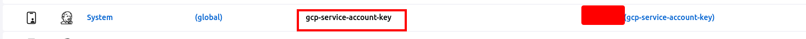
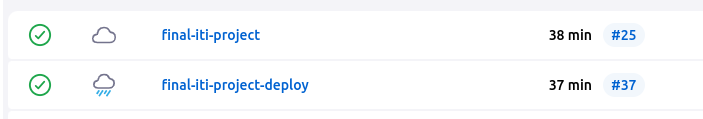
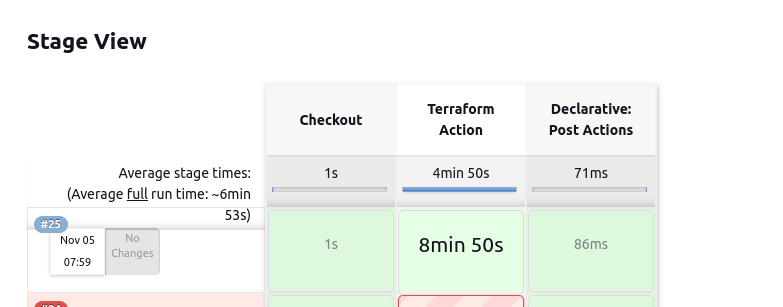
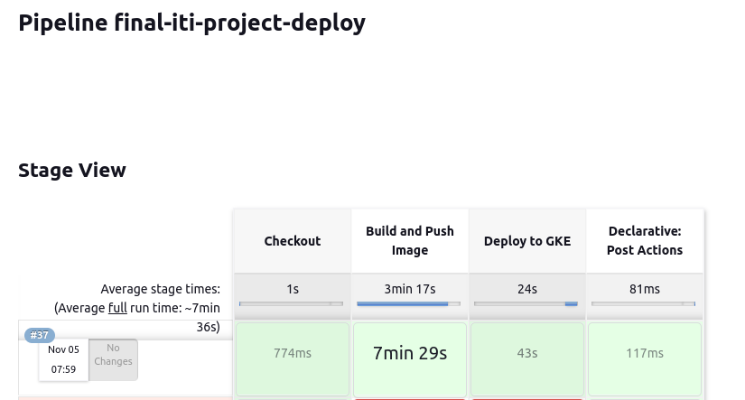
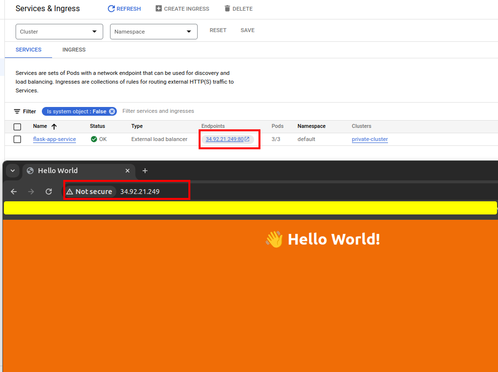
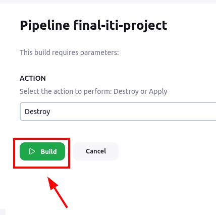

# ITI Final Project 🎯

Welcome to the final project repository for iTi! In this project, we have containerized a simple "Hello World" application and deployed it on Google Kubernetes Engine (GKE). The entire infrastructure and cloud resources were provisioned using Terraform, ensuring a streamlined and automated deployment process. Additionally, we have set up two pipelines to facilitate continuous integration and continuous deployment (CI/CD) using Jenkins.

# You wanna your App like this   ⁉️ " just follow me 😉 "
https://github.com/AbdelrhmanEzzat/GCP-O231-FinalProject/assets/64223277/05259859-9869-4106-9cf8-9e8abf592c1e

# Project Components 📦

1. **IAM:**
   - Two service accounts are created with specific roles to manage permissions effectively.

2. **Networking:**
   - One VPC with two subnets is established.
   - Necessary firewall rules are configured & IAP.
   - NAT gateway is set up for outbound internet access.

3. **Compute:**
   - One private VM is created for specific purposes.
   - A GKE standard cluster is established across three zones.

4. **Storage:**
   - Artifact Registry repository is set up to store Docker images.

5. **Flask app image:**
   - Flask app to display Html template 

7. **Load Balancer:**
   - The web application is exposed using Kubernetes Load Balancer services for external access.
8. **Infrastructure Pipeline**
The first pipeline, the Infrastructure Pipeline, is responsible for provisioning all the necessary cloud resources using Terraform. This pipeline sets up the infrastructure required for running the Hello World application on GKE. Upon successful completion, it triggers the Application Pipeline for deploying the containerized application.

9. **Application Pipeline**
The Application Pipeline is the second stage of our CI/CD process. It utilizes Jenkins as the CI/CD tool to deploy the Hello World container on GKE. This pipeline ensures seamless integration and continuous deployment of changes made to the Hello World application code.

# Deployment Steps 🚀

1. **Set Up Google Cloud Project:**
   - Create a new project on GCP or use an existing one.
   - Enable necessary APIs, including Compute Engine, Kubernetes Engine, Artifact Registry, and IAM.
2. **Add terraform service account to jenkins**

3. **Build pipline:**

   1. Infra pipline
    

   2. deploy pipline
     

4. **App running**

   

      
6. **Now you can access the node pods and you will see LoadBalancer IP to interact with app**

## Clean Up 🚮

